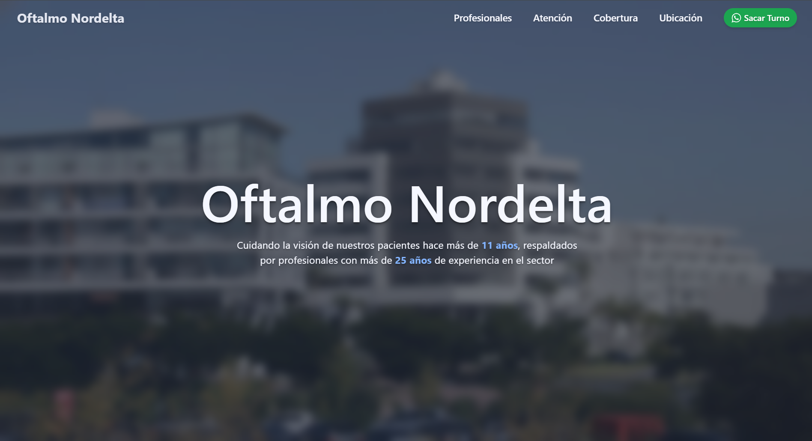
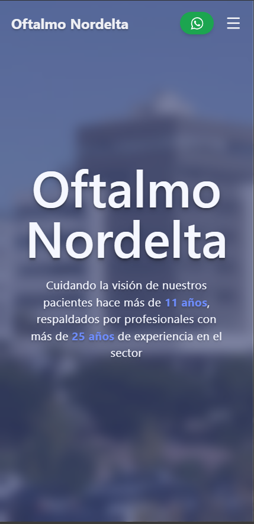

# Oftalmo Nordelta Landing Page

This is the Landing Page for Oftalmo Nordelta Oftalmology Clinic.



<div align="center">
  
</div>

## Site

The site can be accessed by going to <a href="https://oftalmonordelta.com" target="_blank" rel="noopener noreferrer">https://oftalmonordelta.com</a>

## Dependencies

- Node 22.17.0
- Shadcn (Just for the Accordion)
- Lucide React
- Tailwind V4

## Run

Add the githooks for formatting with prettier pre push

```bash
./setup-hooks.sh
```

Install the dependencies

```bash
npm i
```

Run locally for development

```bash
npm run dev
```

## Build

Build for deploy

```bash
npm run build
```
